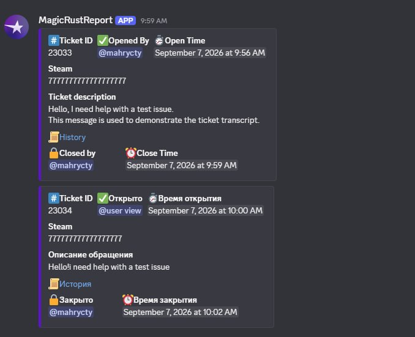
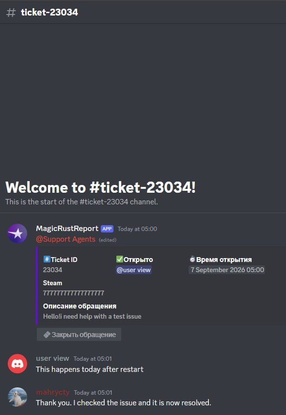

# Message Content Intent Evidence

These screenshots demonstrate how **MagicRustReport** uses message content in its private support-ticket workflow.

Users open a temporary private ticket through a Discord interaction. The ticket participant and authorized support staff then communicate using ordinary messages inside that channel. When the ticket is closed, the bot reads the ticket history, creates an HTML transcript, records the closure, and deletes the temporary channel.

## Closed ticket history

The bot records the closed test tickets in the authorized staff history channel and provides a link to each transcript.

## Generated HTML transcript

The transcript preserves the ordinary messages written by the test participant and support member before the temporary ticket channel was deleted.

Discord buttons and forms can start and manage the ticket, but they do not contain the later conversation history. The Message Content intent is therefore required to produce a complete transcript when the ticket is closed.

The screenshots contain test data created specifically to demonstrate this workflow.
